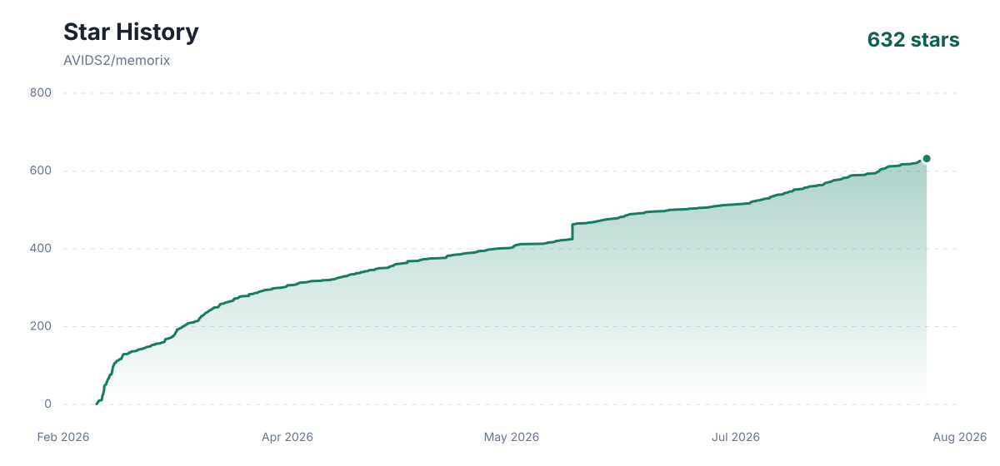

<p align="center">
  
</p>

<h1 align="center">Memorix</h1>

<p align="center">
  <strong>面向 AI Coding Agent 的本地优先共享记忆层。</strong><br>
  让 Claude Code、Codex、CodeBuddy Code、Cursor、Windsurf、Copilot、Gemini CLI、OpenCode、OpenClaw、Hermes Agent、Oh-my-Pi、Pi、Kiro、Antigravity、Trae、DeepSeek Harness 和任何 MCP Agent 共用同一套项目记忆。
</p>

<p align="center">
  <a href="https://www.npmjs.com/package/memorix"></a>
  <a href="https://www.npmjs.com/package/memorix"></a>
  <a href="https://github.com/AVIDS2/memorix/actions/workflows/ci.yml"></a>
  <a href="LICENSE"></a>
  <a href="https://github.com/AVIDS2/memorix"></a>
</p>

<p align="center">
  <a href="https://registry.modelcontextprotocol.io/?q=io.github.AVIDS2%2Fmemorix">已收录至官方 MCP Registry</a>
  <br>
  <a href="https://mcptoplist.com/server/io.github.AVIDS2%2Fmemorix"></a>
</p>

<p align="center">
  <strong>共享项目记忆</strong> | <strong>MCP</strong> | <strong>Git Memory</strong> | <strong>Reasoning Memory</strong> | <strong>插件包</strong> | <strong>编排</strong>
</p>

<p align="center">
  <a href="README.md">English</a> |
  <a href="#安装">安装</a> |
  <a href="#能力矩阵">能力矩阵</a> |
  <a href="#支持你的-agent">Agents</a> |
  <a href="#快速开始">快速开始</a> |
  <a href="#记忆模型">记忆模型</a> |
  <a href="#memcode内置终端-agent">memcode</a> |
  <a href="ACTIVE_WORK.md">当前工作</a> |
  <a href="#文档">文档</a>
</p>

---

> 维护者当前工作状态和公开边界统一记录在
> [ACTIVE_WORK.md](ACTIVE_WORK.md)，这是仓库唯一的活动工作文档。

<h2 id="memorix-是什么"><picture><source media="(prefers-color-scheme: dark)" srcset="assets/tags/light/section-overview.svg"></picture></h2>

Memorix 给你已经在用的 AI 编程 Agent 加上一套共享、可检索的项目记忆，让它跨越新对话、切换 IDE、重开终端 session 和交接都不丢失。记忆归属于 Git 项目，不会只困在某个聊天窗口或工具里。

今天用 Claude Code，明天用 Codex，下午切到 Cursor。Agent 可以换，项目记忆不用重来。

**什么时候该用 Memorix：** 当你一遍遍向新 Agent 重新解释同一个项目时：上个 session 已经搞明白的事丢了，另一个 IDE 看不到这边学到的东西，某个设计决策埋在旧聊天里找不到。

| 问题 | Memorix 提供什么 |
| --- | --- |
| 下一个 session 忘了上一个 session 学到的东西 | 项目级记忆、session 摘要、timeline 和 detail 检索 |
| 不同 Agent 各记各的 | 通过 MCP、hooks、CLI、SDK 和内置终端 Agent 共用同一套本地记忆池 |
| Git 记录了改动，但 Agent 很难检索工程事实 | Git Memory 把 commit 转成可搜索的工程记忆 |
| 架构决策散落在旧聊天里 | Reasoning Memory 存储原因、替代方案和 trade-off |
| 静态规则文件容易过期 | 坑点、修复和项目技能从真实工作中持续沉淀 |
| 并行 Agent 工作容易乱 | `memorix orchestrate` 负责协调任务上下文、交接、文件锁、验证和 review 流程 |

Memorix 是本地优先的。SQLite 是权威存储，Orama 负责搜索，LLM 记忆整理和 embedding 是可选能力。没有模型 key 时，Memorix 仍然可以用本地全文检索工作。

### 能力矩阵

Memorix 不只是一个记忆库。它还负责安装 Agent 接入、保留有用的工作事件、把 commit 转成工程事实、提供本地控制面，并在需要时协调多 Agent 工作。

| 能力 | 作用 | 入口 |
| --- | --- | --- |
| Memory Autopilot | 给新 Agent session 一份有预算的任务 Workset，包含起步文件、当前记忆、来源知识、工作流首步、风险提示和验证建议。CLI 回退可用紧凑 JSON 回执，不再读取整套内部对象。 | `memorix context "..." --brief-json`、`memorix resume "..." --brief-json`、`memorix_project_context` |
| Observation Memory | 当前 Git 项目内可检索的事实、修复、坑点、session 摘要和实现记录 | `memorix memory`、MCP memory tools |
| 受管理的长期记忆 | 有来源证据、可审核的情景/语义/程序记忆；只有明确标为可携带的用户记忆才可在本机跨项目使用 | `memorix memory long-term` |
| Code State 和 Code Memory | 可版本化的本地代码快照、文件 / symbol 关联和 freshness 检查。内置 Lite 会如实说明边界；已有本地索引的 CodeGraph 可额外给出有预算的语义关系，但只有新鲜时才会用于任务。 | `memorix codegraph status\|init\|sync`、自动 context refresh |
| Git Memory | 从 commit 中提取工程事实，回答改了什么、在哪里改、为什么重要 | `memorix ingest commit`、git hook |
| Reasoning Memory | 保存设计原因、备选方案、trade-off 和风险，不让决策只留在一次聊天里 | `memorix reasoning`、memory formation |
| Knowledge Workspace | 有审核门槛的来源证据 Claim、Markdown 知识页和规范化项目工作流；提案不会悄悄覆盖已审阅页面 | `memorix knowledge`、`memorix knowledge workflow` |
| Agent setup | 按目标 Agent 写入 MCP、rules、hooks、skills、plugin、bundle 或 extension | `memorix setup --agent <agent>` |
| Agent doctor | 检查 Agent 的 MCP 配置和规则是否是当前版本，并修复 Memorix 自己管理的条目 | `memorix doctor agents`、`memorix repair agents` |
| Hooks 和 skills | 在支持的 Agent 中可选捕获工作事件，并把稳定知识提升成可复用项目技能 | `memorix hooks`、`memorix skills` |
| Dashboard 和 HTTP | 本地 Web UI 与共享 MCP endpoint，用于浏览记忆、项目状态、团队和诊断信息 | `memorix dashboard`、`memorix background start` |
| Orchestration 和团队协作 | 任务规划、worker 交接、文件锁、消息、验证门和 review loop | `memorix orchestrate`、`memorix team`、`memorix lock` |
| memcode | 内置终端 Coding Agent，默认读写同一套项目记忆 | `memorix`、`memcode` |
| CLI 和 SDK | 给自动化、导入导出、诊断和自定义集成使用的本地接口 | `memorix ...`、`createMemoryClient()` |

<h2 id="支持你的-agent"><picture><source media="(prefers-color-scheme: dark)" srcset="assets/tags/light/section-agents.svg"></picture></h2>

Memorix 通过目标 Agent 已有的接口接入：插件包、MCP、项目规则、hooks、skills，或者内置终端 Agent。`memorix setup` 会为每个 Agent 选择合适的接入方式，默认使用 stdio MCP。

<table>
<tr>
<td align="center" width="12.5%">
<a href="https://claude.com/product/claude-code"></a><br>
<strong>Claude Code</strong><br>
<sub>官方插件 + MCP + hooks + skills</sub>
</td>
<td align="center" width="12.5%">
<a href="https://github.com/openai/codex"></a><br>
<strong>Codex CLI</strong><br>
<sub>官方插件 + MCP + AGENTS.md</sub>
</td>
<td align="center" width="12.5%">
<a href="https://github.com/features/copilot"></a><br>
<strong>GitHub Copilot CLI</strong><br>
<sub>插件 + MCP + hooks + skills</sub>
</td>
<td align="center" width="12.5%">
<a href="https://cursor.com"><picture><source media="(prefers-color-scheme: dark)" srcset="https://svgl.app/library/cursor_dark.svg"></picture></a><br>
<strong>Cursor</strong><br>
<sub>MCP + rules + skills</sub>
</td>
<td align="center" width="12.5%">
<a href="https://windsurf.com"><picture><source media="(prefers-color-scheme: dark)" srcset="https://svgl.app/library/windsurf-dark.svg"></picture></a><br>
<strong>Windsurf</strong><br>
<sub>MCP + rules + hooks</sub>
</td>
<td align="center" width="12.5%">
<a href="https://github.com/google-gemini/gemini-cli"></a><br>
<strong>Gemini CLI</strong><br>
<sub>extension + MCP + hooks + skills</sub>
</td>
</tr>
<tr>
<td align="center" width="12.5%">
<a href="https://github.com/opencode-ai/opencode"><picture><source media="(prefers-color-scheme: dark)" srcset="https://svgl.app/library/opencode-dark.svg"></picture></a><br>
<strong>OpenCode</strong><br>
<sub>local plugin + MCP + skills + AGENTS.md</sub>
</td>
<td align="center" width="12.5%">
<a href="https://pi.dev"></a><br>
<strong>pi coding agent</strong><br>
<sub>package + extension + skill</sub>
</td>
<td align="center" width="12.5%">
<a href="https://kiro.dev"></a><br>
<strong>Kiro</strong><br>
<sub>MCP + steering + hooks</sub>
</td>
<td align="center" width="12.5%">
<a href="https://antigravity.google"></a><br>
<strong>Antigravity</strong><br>
<sub>plugin + MCP + hooks + skills</sub>
</td>
<td align="center" width="12.5%">
<a href="https://www.trae.ai"></a><br>
<strong>Trae</strong><br>
<sub>MCP + project rules</sub>
</td>
<td align="center" width="12.5%">
<br>
<strong>memcode</strong><br>
<sub>内置终端 Agent</sub>
</td>
</tr>
<tr>
<td align="center" width="12.5%">
<a href="https://docs.openclaw.ai"></a><br>
<strong>OpenClaw</strong><br>
<sub>bundle + MCP + hooks + skills</sub>
</td>
<td align="center" width="12.5%">
<a href="https://hermes-agent.nousresearch.com"></a><br>
<strong>Hermes Agent</strong><br>
<sub>plugin + MCP + hooks + skills</sub>
</td>
<td align="center" width="12.5%">
<a href="https://omp.sh"></a><br>
<strong>Oh-my-Pi</strong><br>
<sub>package + MCP + hooks + skills</sub>
</td>
<td align="center" width="12.5%">
<a href="https://github.com/deepseek-ai/deepseek-harness"></a><br>
<strong>DeepSeek Harness</strong><br>
<sub>MCP patch + AGENTS.md + skills</sub>
</td>
<td align="center" width="12.5%">
<a href="https://modelcontextprotocol.io"></a><br>
<strong>Any MCP Client</strong><br>
<sub>stdio or HTTP MCP</sub>
</td>
</tr>
</table>

<p align="center">
  <sub>支持 MCP、hooks/rules 或插件/包入口的 Agent。所有 Agent 共用同一套本地优先记忆层。</sub>
</p>

接入面：

| 接入面 | 作用 | Memorix 入口 |
| --- | --- | --- |
| Setup 命令 | 一次性安装推荐的用户级 Memorix 接入 | `memorix setup --agent <agent> --global` |
| MCP | 给 Agent 提供搜索、详情检索、写入、reasoning 和协同工具 | setup 包内置，或手动运行 `memorix serve` |
| 使用规范 | 告诉 Agent 什么时候、怎么使用 Memorix，而不是每轮都强制查记忆 | 由 `memorix setup` 打包或生成 |
| Hooks | 在 Agent 支持时可选地捕获 prompt、tool 事件、文件编辑、session 生命周期和原生上下文压缩检查点 | 由 `memorix setup` 打包或生成 |
| 插件 / Bundle / Package | 给支持插件、兼容 bundle 或 package 的 Agent 安装对应文件 | Claude Code、Codex、CodeBuddy Code、GitHub Copilot CLI、Antigravity、OpenClaw、Hermes Agent、Oh-my-Pi、Pi |
| Extension | 给支持 extension 的 Agent 安装对应文件 | Gemini CLI |
| 本地插件 | 给直接加载本地插件文件的 Agent 安装插件 | OpenCode |
| MCP / rules 配置 | 给支持 MCP、rules、steering、guidance 或 hooks 的 IDE 和 Agent 写入配置 | Cursor、Windsurf、Kiro、Trae、DeepSeek Harness |
| Skills | 把沉淀下来的项目知识提升成可复用任务指导 | `memorix skills` 和 `memorix_promote` |
| memcode | 打开已经接好 Memorix 记忆的内置终端 Agent | `memorix` 或 `memcode` |

当前支持矩阵和各类生成文件说明见 [集成形态](docs/INTEGRATIONS.md)。

如果你想给某个仓库写项目级指导、规则或 hooks，再在那个仓库里运行一次不带 `--global` 的 `memorix setup --agent <agent>`。

CLI、MCP 和 HTTP 是不同入口：

- `memorix` CLI 用于直接操作：setup、记忆搜索/写入、Git Memory、导入导出、Dashboard、编排、诊断和自动化。
- `memorix serve` 是给 IDE / Coding Agent 使用的 stdio MCP 桥。
- `memorix background start` / `memorix serve-http` 是 HTTP 服务，用于共享端点、Dashboard、Docker 或多客户端。

<h2 id="安装"><picture><source media="(prefers-color-scheme: dark)" srcset="assets/tags/light/section-install.svg"></picture></h2>

要求：

- Node.js `>=22.18.0`
- Git，因为项目身份来自真实 Git root

安装并初始化：

```bash
npm install -g memorix
memorix init --global                   # 可选默认配置
memorix setup --agent claude --global   # 也可以是 codex、copilot、cursor、pi、gemini-cli、opencode、
                                       # codebuddy、windsurf、kiro、antigravity、trae、openclaw、hermes、omp
```

`memorix init` 是可选的，它会创建或更新 TOML 配置：

- `~/.memorix/config.toml`：全局默认配置
- `<git-root>/memorix.toml`：可选项目覆盖配置

旧的 `memorix.yml`、`.env` 和 `~/.memorix/config.json` 仍兼容读取，但新文档和新初始化流程都以 TOML 为准。

如果你想给某个仓库加项目级指导或 hooks，就在那个仓库目录里再跑一次不带 `--global` 的 `memorix setup --agent <agent>`。

<h2 id="快速开始"><picture><source media="(prefers-color-scheme: dark)" srcset="assets/tags/light/section-quick-start.svg"></picture></h2>

### 连接现有 Agent

先用 setup 命令。全局形式是一键接入的默认路径：

```bash
memorix setup --agent claude --global
memorix setup --agent codex --global
memorix setup --agent copilot --global
memorix setup --agent cursor --global
memorix setup --agent pi --global
memorix setup --agent gemini-cli --global
memorix setup --agent opencode --global
memorix setup --agent windsurf --global
memorix setup --agent kiro --global
memorix setup --agent antigravity --global
memorix setup --agent trae --global
memorix setup --agent openclaw --global
memorix setup --agent hermes --global
memorix setup --agent codebuddy --global
memorix setup --agent omp --global
memorix setup --agent dsh --global
```

它会做的事情取决于目标 Agent，但目标是一致的：你以后在哪里打开这个 Agent，Memorix 就可以在哪里被使用，而不是让你一个仓库一个仓库重复配置。

- Claude Code：安装 Memorix 插件包，写入 `CLAUDE.md` 使用规范；不加 `--noHooks` 时会启用自动捕获。
- Codex：安装包含 stdio MCP、skills 和生命周期 hooks 的 Memorix 插件包，并写入 `AGENTS.md` 使用规范。Codex 首次要求时，在 `/hooks` 中审核一次插件 hook；使用 `--noHooks` 可跳过自动捕获。
- GitHub Copilot CLI：安装 Copilot 插件包和官方 Memorix skills。
- Pi：安装用户级 Pi package 和官方 skills。
- Cursor：写入 Cursor 的 MCP / rules / 配置。
- Gemini CLI：安装 extension package、`GEMINI.md` 上下文、hooks 和 skills。Antigravity CLI 有官方 Gemini CLI migration 路径，但 Gemini CLI 仍是活跃的独立 target。
- OpenCode：安装本地插件文件、`opencode.json`、skills 和 `AGENTS.md` 指引。
- Windsurf、Kiro、Trae：写入目标支持的 MCP / rules / hooks 文件。
- Antigravity：安装官方 plugin package，包含 `plugin.json`、`mcp_config.json`、`hooks.json`、rules 和 skills，路径为 `~/.gemini/config/plugins/memorix` 或 `.agents/plugins/memorix`。
- OpenClaw：安装 OpenClaw 兼容 bundle，包含 `.mcp.json`、官方 skills 和 OpenClaw `HOOK.md` / `handler.ts` hook pack。
- Hermes Agent：安装到 Hermes home（Windows native 默认为 `%LOCALAPPDATA%\hermes`，其他平台默认为 `~/.hermes`，也支持 `HERMES_HOME`），在 `config.yaml` 启用插件，注册 plugin hooks、slash/CLI commands、skills，并写入 MCP 配置。
- CodeBuddy Code：安装用户级本地市场插件到 `~/.codebuddy/memorix-local`，包含 MCP、skills 和 hooks。它不会修改既有的 CodeBuddy 模型、权限或 settings 文件；第三方 hook 仍由 CodeBuddy 自己的 `/hooks` 流程确认。
- Oh-my-Pi：安装 `omp.extensions` package，包含 extension hook 事件、`memorix` command、官方 skills，并写入 MCP 配置。
- DeepSeek Harness：向 `$DSH_HOME/cordis.patch.yml`（默认 `~/.dsh/cordis.patch.yml`）写入一行 Memorix `@deepseek-ai/dsh-mcp-client`，向 harness 的 `AGENTS.md` 追加使用规范，并把官方 skills 安装到 `$DSH_HOME/skills`。这一行遵循 DSH 自带的 Memorix 参考配置，因此工具以 `mcp__memorix__*` 形式出现。

如果你想要更安静一点的安装，可以对那些 setup 能独立控制 hook capture 的 target 加 `--noHooks`。它会保留 MCP 和使用规范，只跳过 Memorix 的 hook 自动捕获。

如果你明确想要项目级指导或 hooks，就在那个仓库目录里再跑一次不带 `--global` 的 `memorix setup --agent <agent>`。

如果你的 Agent 只需要手动 MCP 配置，使用 stdio：

```json
{
  "mcpServers": {
    "memorix": {
      "command": "memorix",
      "args": ["serve"]
    }
  }
}
```

如果是手动维护 Claude Code 的 MCP 配置，需要在 `memorix` server 对象里加上 `"alwaysLoad": true`。这样 Claude Code 在 print-mode 启动时就会暴露 Memorix tools；`memorix doctor agents --agent claude` 可以检查并修复缺失的设置。

普通安装不需要 HTTP。只有在你明确需要共享后台服务、Dashboard、Docker，或多个客户端共用一个端点时才使用：

```bash
memorix background start
```

然后让客户端连接：

```text
http://localhost:3211/mcp
```

HTTP 模式下，如果客户端能提供工作区路径，Agent 应使用 `memorix_session_start(projectRoot=...)` 显式绑定当前仓库。最终项目身份仍以 Git 为准。

### 卸载

先预览：

```bash
memorix uninstall --dry-run
```

停止后台服务并移除 hooks：

```bash
memorix uninstall --background --hooks
```

完整清理：

```bash
memorix uninstall --yes --background --hooks --purge-data
npm uninstall -g memorix
```

`memorix uninstall` 会把需要手动清理的 MCP 配置路径列出来，不会悄悄去改你所有 MCP 文件。

### 从 CLI 管理记忆

```bash
memorix --cwd /path/to/repo resume "继续处理发布阻塞问题"
memorix checkpoint list
memorix memory search --query "release blocker"
memorix memory --help

# 可选：只在需要个人/团队记忆或协同时激活本地身份。
memorix identity join --agent-type codex --name codex-main
memorix memory store --text "个人排查笔记" --visibility personal
memorix task create --description "验证发布包"

# 有意沉淀长期记忆：先创建候选，再审核，审核前不会进入 Agent 的 Workset。
memorix memory long-term add --kind procedural --scope user --portability portable --title "发布验证偏好" --text "发布 npm 包前运行 focused tests 和打包后的 package smoke。" --applicability "发布 npm 包时。"
memorix memory long-term qualify --id <id> --reason "用户明确确认了这项偏好。"
memorix memory long-term approve --id <id> --reason "已审核，可在本机其它项目中使用。"

memorix transfer export --format json --out ./.memorix-export.json
memorix transfer import --file ./.memorix-export.json
memorix reasoning search --query "why sqlite"
memorix git-hook --force
memorix ingest log --count 20
memorix workbench
```

CLI 是直接入口，不依赖 MCP 会话。它默认绑定当前 Git 项目，也可以用 `--cwd` 指定项目。没有激活身份时，只会读写和导出项目公开记忆；只有明确需要个人/团队记忆或协同任务时，才运行 `memorix identity join` 或 `memorix identity use --agent-id <id>`。`memorix identity clear` 会回到项目公开范围；脚本可用一次性的 `--as <active-agent-id>`。已有 camelCase 参数仍兼容，kebab-case 也可直接使用。

### 管理受控媒体

媒体是显式、可控的。导入本地文件后，Memorix 会将其复制到本地数据目录、计算哈希，并放在 Git 工作区之外；只有执行附着操作后，资产才会进入普通项目记忆。它不会自动抓取每一张截图或工具输出。默认媒体资产上限为 100 MiB；自动视觉分析单独限制为 20 MiB。更大的图片仍可保存和附着，但不会被强行发送给模型，而是会留下明确的文本回退说明。

```bash
memorix media import --path ./architecture.png --json
memorix media attach --asset <asset-id> --title "架构图" --json
memorix media list --kind image --json
memorix media show --asset <asset-id> --json
memorix media remove --asset <asset-id> --force --json

# 受控派生：显式、有边界、可附着进记忆。
memorix media derive-pdf --asset <asset-id> --attach --json
memorix media derive-audio --asset <asset-id> --attach --json

# 旧的图像分析命令现在也会走同一套受控资产生命周期。
memorix ingest image --path ./architecture.png --json
```

MiniMax 图像生成是需要明确执行的 CLI 操作。视频生成会立即返回一个可持久查询的任务，不会把 Agent 请求卡在等待生成结果上。

```bash
# 在用户环境变量或 .env 中配置 MINIMAX_API_KEY，绝不要提交进 Git。
memorix media generate image --prompt "清晰的系统架构图" --json
# 图生图（MiniMax image-01 / image-01-live，通过 subject_reference）：
memorix media generate image --prompt "保留主体、更换背景" --image ./reference.png --json
memorix media generate video --prompt "简短的产品演示" --json
memorix media status --job <media-job-id> --json
memorix media cancel --job <media-job-id> --json
```

`memorix_media` 是所有 profile（包括 `micro`）中都有的紧凑 MCP 对应入口，可导入、附着、列出、查看、派生 PDF/音频、生成并查询任务状态。因为图像/视频生成可能产生 provider 费用，MCP 默认禁止生成；只有你明确允许 Agent 付费调用时，才设置 `MEMORIX_MCP_MEDIA_GENERATION=1`。默认的 OpenRouter 文本 embedding 仍然只是文本向量；只有明确声明支持该模态的 provider 才会生成媒体向量。文本描述和附着信息仍可通过普通检索使用。

### 使用内置终端 Agent

```bash
memorix
# 或
memcode
```

这会打开 memcode：一个已经接好 Memorix 记忆的终端 Coding Agent。

<h2 id="记忆模型"><picture><source media="(prefers-color-scheme: dark)" srcset="assets/tags/light/section-memory-model.svg"></picture></h2>

| 层 | 存什么 | 适合回答 |
| --- | --- | --- |
| Observation Memory | 事实、坑点、修复、实现说明 | “这里是怎么工作的？” |
| Reasoning Memory | 原因、替代方案、约束、风险 | “当时为什么这么选？” |
| Git Memory | 从 commit 提炼出的工程事实 | “最近改了什么，在哪些文件？” |
| Code Memory | 文件、符号、import 关系、记忆到代码的新鲜度 | “现在应该先看哪些代码？” |
| 受管理的长期记忆 | 有来源证据、经过审核的情景事件、稳定事实或可复用流程 | “以后还应记住什么、按什么方式做？” |
| Compact Continuity | 最近一次宿主原生压缩的摘要或生命周期标记 | “上次上下文压缩后留下了什么？” |

默认搜索当前项目。`scope="global"` 可以跨项目搜索。“改了什么”优先匹配 Git Memory，“为什么”优先匹配 reasoning / decision 记录。

长期记忆不是把所有笔记自动堆进去。Observation、Claim、工作流、session 和代码快照仍各自承担原来的职责。Agent 可以在 `memorix_store` 时要求额外生成长期记忆**候选**，但候选绝不会自动进入任务上下文；用 `memorix memory long-term qualify|approve|archive|supersede` 留下带证据的生命周期记录。只有人工创建或用户确认的 `user + portable` 记忆，才可能在同一台机器的其它项目中按任务相关性被使用；项目代码、Git 事实、测试、工作流、session 和 Observation 都不能被提升成可携带的用户记忆。

`memorix context "..."` 是默认的 Memory Autopilot 入口。它会按任务生成紧凑 brief：修 bug 时偏向测试和复现，发版时偏向 package/changelog/build 检查，接手项目时偏向文档和入口文件；过期或不相关的记忆只作为 warning，不会一股脑塞进 prompt。CLI 回退需要结构化结果时用 `--brief-json`，它只返回同一份有预算的 brief 和“选了什么、略了什么”的回执；`--json` 保留给详细诊断。普通新任务不会自动得到旧会话的文本倾倒；明确要继续之前工作时，用 `memorix resume "..."`，只会补入最近一份有用的会话总结、最多三条当前可读的长期记忆锚点，以及最多一条带来源标识的近期宿主压缩检查点。每个长期锚点都有 `durable:<id>` 引用，Agent 只在确实需要完整已审核记录时才通过 `memorix_detail` 展开。关键词仍优先；没有命中而且用户已配置 embedding 时，Memorix 才会做一次 1.8 秒、不重试的语义回退，用于模型改写或跨语言任务。服务变慢或不可用时，正常的关键词 Workset 会原样返回。检查点只是生命周期证据，不是长期记忆，也不是聊天记录备份。Agent 应该先读 suggested files，再相信历史记忆。

<h2 id="运行模式"><picture><source media="(prefers-color-scheme: dark)" srcset="assets/tags/light/section-runtime.svg"></picture></h2>

| 你想做什么 | 运行 |
| --- | --- |
| 安装某个 Agent 的接入包 | `memorix setup --agent <agent> --global` |
| 检查或修复某个 Agent 接入 | `memorix doctor agents --agent <agent>`、`memorix repair agents --agent <agent>` |
| 手动暴露 stdio MCP | `memorix serve` |
| 启动共享 HTTP MCP 和 Dashboard | `memorix background start` |
| 前台调试 HTTP MCP | `memorix serve-http --port 3211` |
| 直接检查或管理记忆 | `memorix memory`、`memorix reasoning`、`memorix session`、`memorix ingest`、`memorix media` |
| 管理已审核的长期记忆 | `memorix memory long-term list|show|add|promote|qualify|approve|archive|supersede` |
| 检查原生上下文压缩连续性 | `memorix checkpoint list|show|context|archive` |
| 使用交互式终端记忆控制台 | `memorix workbench` |
| 使用内置终端 Agent | `memorix` 或 `memcode` |
| 运行编排式 subagent 工作 | `memorix orchestrate --goal "..."` |

`memorix orchestrate` 单 worker 默认使用当前 checkout；多 worker 时会在 `.worktrees/` 下为任务创建隔离 worktree，并把成功的任务分支 merge 回来。用 `--isolated` 可强制单 worker 也隔离，用 `--no-worktree` 禁用 worktree，用 `--allow-dirty` 允许带未提交改动运行，用 `--no-auto-merge` 保留任务 worktree 方便人工 review。

<h2 id="memcode内置终端-agent"><picture><source media="(prefers-color-scheme: dark)" srcset="assets/tags/light/section-memcode.svg"></picture></h2>

memcode 是 Memorix 内置的终端 Coding Agent。它能读文件、改代码、运行命令、恢复 session、切换模型，并提供 `/memory` 命令；读写的仍然是同一套 Memorix 项目记忆。

想要一个开箱即用、已经带记忆的终端 Agent 时用它。

```text
one Git project -> one shared Memorix memory pool
```

memcode 专门说明见 [docs/MEMCODE.md](docs/MEMCODE.md)。

<h2 id="配置"><picture><source media="(prefers-color-scheme: dark)" srcset="assets/tags/light/section-configuration.svg"></picture></h2>

最小 `~/.memorix/config.toml`：

```toml
[agent]
provider = "openai"
model = "gpt-4o"
api_key = "..."

[memory.llm]
provider = "openai"
model = "gpt-4o-mini"
api_key = "..."

[embedding]
provider = "auto"

[memory]
inject = "minimal"
formation = "active"
```

`[memory.llm]` 和 `[embedding]` 负责记忆质量和检索；`[agent]` 是 memcode 编码时使用的模型。凭据放全局配置或环境变量，不要提交 secrets。

如果使用 OpenRouter embedding，可以设置 `provider = "api"`、`base_url = "https://openrouter.ai/api/v1"`、`model = "qwen/qwen3-embedding-8b"`。这个 endpoint 下 Memorix 会读取官方 `OPENROUTER_API_KEY`；需要单独覆盖 embedding key 时仍可用 `MEMORIX_EMBEDDING_API_KEY`。

受控 MiniMax 媒体生成可在环境变量或 `.env` 中设置全局 `MINIMAX_API_KEY`，或中国区 `MINIMAX_CN_API_KEY`。媒体库不会保存该 key、临时签名 URL 或 base64 负载。CLI 生成本身就是显式操作；若要让 MCP 中的 Agent 发起生成，还必须明确设置 `MEMORIX_MCP_MEDIA_GENERATION=1`。

<h2 id="docker"><picture><source media="(prefers-color-scheme: dark)" srcset="assets/tags/light/section-docker.svg"></picture></h2>

Docker 用于 HTTP 服务，不是 stdio MCP：

```bash
docker compose up --build -d
```

启动后：

- Dashboard：`http://localhost:3211`
- MCP：`http://localhost:3211/mcp`
- Health：`http://localhost:3211/health`

如果要使用项目级 Git / 配置行为，容器必须能看到传给 `projectRoot` 的仓库路径。

<h2 id="sdk"><picture><source media="(prefers-color-scheme: dark)" srcset="assets/tags/light/section-sdk.svg"></picture></h2>

在 TypeScript 中直接使用 Memorix：

```ts
import { createMemoryClient } from 'memorix/sdk';

const client = await createMemoryClient({ projectRoot: '/path/to/repo' });

await client.store({
  entityName: 'auth-module',
  type: 'decision',
  title: 'Use JWT for API auth',
  narrative: 'Chose JWT because the API is stateless and used by multiple clients.',
});

const results = await client.search({ query: 'auth decision' });
await client.close();
```

<h2 id="文档"><picture><source media="(prefers-color-scheme: dark)" srcset="assets/tags/light/section-docs.svg"></picture></h2>

| 从这里开始 | 适合场景 |
| --- | --- |
| [文档地图](docs/README.md) | 快速找到正确文档 |
| [安装与接入](docs/SETUP.md) | 安装、使用 `memorix setup`、选择 stdio vs HTTP |
| [集成形态](docs/INTEGRATIONS.md) | 插件包、MCP、项目规则、hooks 和 skills 支持 |
| [配置指南](docs/CONFIGURATION.md) | TOML 配置、模型 lane、兼容文件 |
| [API 参考](docs/API_REFERENCE.md) | MCP 工具和 CLI 命令 |
| [Git Memory](docs/GIT_MEMORY.md) | commit 摄入和工程事实检索 |
| [Docker](docs/DOCKER.md) | 容器化 HTTP 服务 |
| [memcode](docs/MEMCODE.md) | 使用内置终端 Agent |
| [Agent Playbook](docs/AGENT_OPERATOR_PLAYBOOK.md) | 面向 AI Agent 的安装、绑定、hooks、排障手册 |
| [开发指南](docs/DEVELOPMENT.md) | 贡献、测试、发布检查 |
| [更新日志](CHANGELOG.md) | 每个版本改了什么 |

LLM 友好摘要：[llms.txt](llms.txt) 和 [llms-full.txt](llms-full.txt)。

<h2 id="开发"><picture><source media="(prefers-color-scheme: dark)" srcset="assets/tags/light/section-development.svg"></picture></h2>

```bash
git clone https://github.com/AVIDS2/memorix.git
cd memorix
npm install
npm run lint
npm test
npm run build
```

<h2 id="鸣谢"><picture><source media="(prefers-color-scheme: dark)" srcset="assets/tags/light/section-acknowledgements.svg"></picture></h2>

Memorix 借鉴了 MCP 生态和 mcp-memory-service、MemCP、claude-mem、Mem0 等记忆项目的做法。memcode 基于 Pi coding-agent codebase，针对 Memorix 生态做了适配。

<h2 id="license"><picture><source media="(prefers-color-scheme: dark)" srcset="assets/tags/light/section-license.svg"></picture></h2>

[Apache 2.0](LICENSE)

<h2 id="star-history">Star 历史</h2>

<a href="https://github.com/AVIDS2/memorix/stargazers">
  <picture>
    <source media="(prefers-color-scheme: dark)" srcset="assets/star-history-dark.svg">
    <source media="(prefers-color-scheme: light)" srcset="assets/star-history-light.svg">
    
  </picture>
</a>

<sub>由 GitHub Actions 根据 GitHub stargazer 事件每日生成。</sub>
